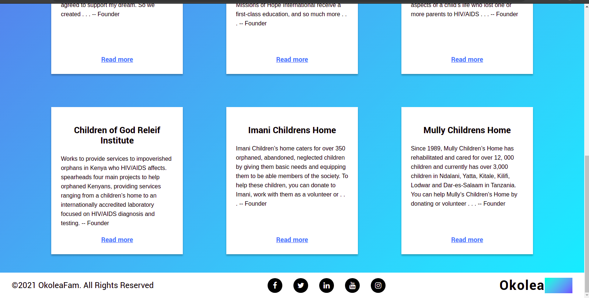

# OkoleaFam

## A peek of the page



## Table of Content

+ [Description](#Description)
+ [Languages](##Languagesused)
+ [Usage](##Tousethetemplate)
+ [Contributing](##Contributing)
+ [Reference](#reference)
+ [Licence](##Licence)
+ [Author](##Author)

## Description
A website that links donors and volunteers to organizations that are established to help needy families and children.

* [Click here to view site](https://lyonsmasawa.github.io/OkoleaFam/)

## Language used
This is a restaurant landing page template made of only HTML and CSS.
  -HTML for the page structure.
  -CSS for the page styling
  -JS used for adding functionality

## To use the template.
```

## Usage
* Requirements

> A device able to display a webpage.

> A code editor.

> Basic knowledge on HTML, CSS and JavaScript

* Installation

> Clone repository or click on the download code button.

> customize to your liking.

```

## Contributing
Pull requests are welcome at all times. the more the merrier

Please make sure you update the branches when you make changes plus a detailed guideline(commits) of changes made.

## Reference
* Basics of HTML and CSS and Javascript

## License
[MIT Licence](https://github.com/Lyonsmasawa/OkoleaFam/blob/a1dc1f45c8a025841131ee48c6ce238577909c3f/Licence.md)

MIT License

Copyright (c) 2021 OKoleaFam

Permission is hereby granted, free of charge, to any person obtaining a copy
of this software and associated documentation files (the "Software"), to deal
in the Software without restriction, including without limitation the rights
to use, copy, modify, merge, publish, distribute, sublicense, and/or sell
copies of the Software, and to permit persons to whom the Software is
furnished to do so, subject to the following conditions:

The above copyright notice and this permission notice shall be included in all
copies or substantial portions of the Software.

THE SOFTWARE IS PROVIDED "AS IS", WITHOUT WARRANTY OF ANY KIND, EXPRESS OR
IMPLIED, INCLUDING BUT NOT LIMITED TO THE WARRANTIES OF MERCHANTABILITY,
FITNESS FOR A PARTICULAR PURPOSE AND NONINFRINGEMENT. IN NO EVENT SHALL THE
AUTHORS OR COPYRIGHT HOLDERS BE LIABLE FOR ANY CLAIM, DAMAGES OR OTHER
LIABILITY, WHETHER IN AN ACTION OF CONTRACT, TORT OR OTHERWISE, ARISING FROM,
OUT OF OR IN CONNECTION WITH THE SOFTWARE OR THE USE OR OTHER DEALINGS IN THE
SOFTWARE.


## Author
* Lyons Albert Masawa.

##
* Catherene Wangari
* Moi Shadrack
* Daniel Muthama

[Go Back to the top](#OkoleaFam)